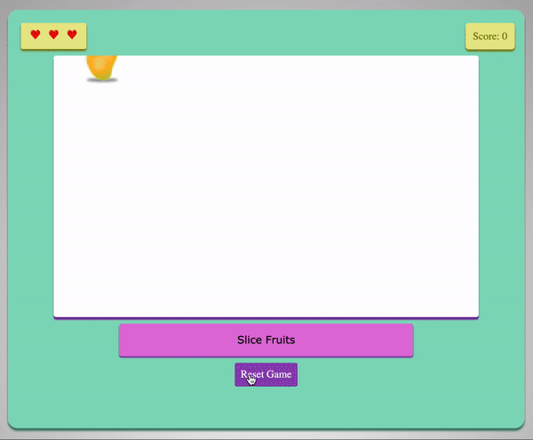

# Fruit-Slice-Game

GH-Pages : https://developer-soni.github.io/Fruit-Slice-Game/ 

## Description
I have created a Fruit Slice Game using jQuery and basic HTML and CSS. The game starts with a home screen and 3 Lives. The score increases as you keep slicing the fruits and the game ends when you run out of all 3 lives. There is no time limit. Integrated jQuery and AJAX calls in the web application to enhance functionality, and user experience for kids.

## How to Play Game
Run index.html to play.

## Gameplay

